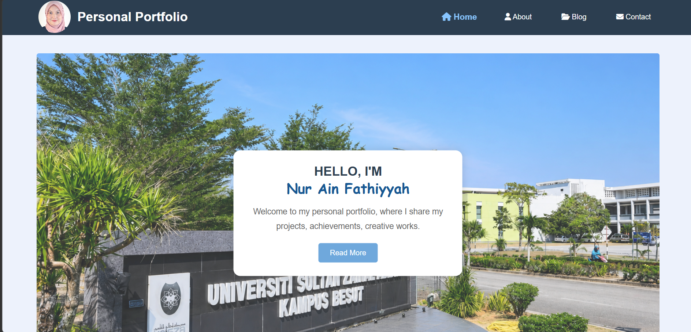
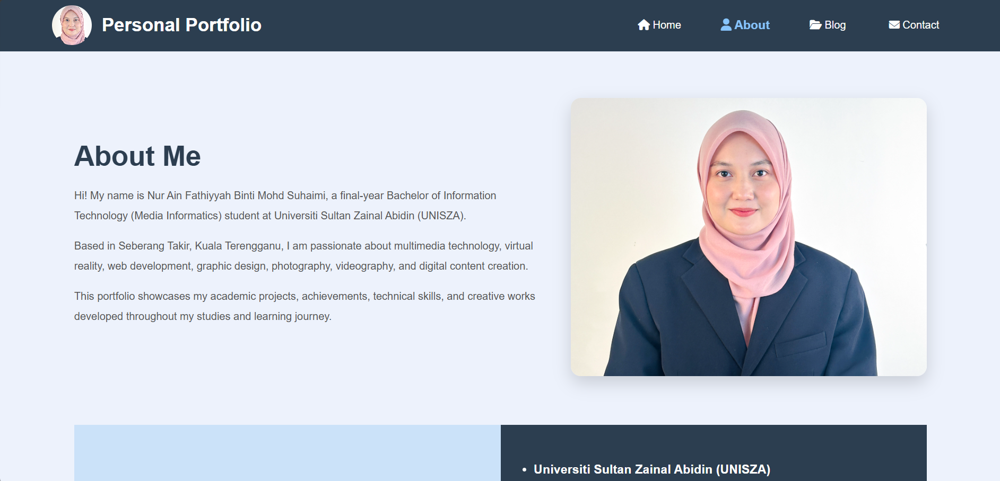
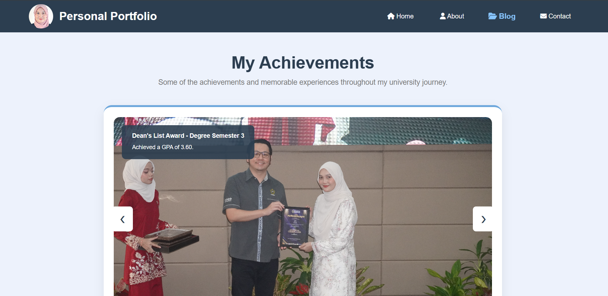
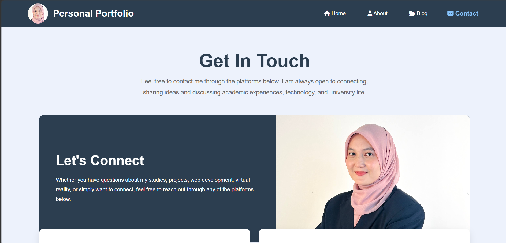

## 1. Project Title

Personal Portfolio Website

---

## 2. Project Description

This Personal Portfolio Website was developed as part of the CSD34203: Special Topics in Software Development individual project.

The website serves as a digital portfolio that showcases my academic background, technical skills, achievements, projects, creative works, and professional information. It was designed to provide visitors with a comprehensive overview of my journey as a Bachelor of Information Technology (Media Informatics) student at Universiti Sultan Zainal Abidin (UNISZA).

The portfolio highlights various projects developed throughout my studies, including web development, virtual reality applications, 3D animation, graphic design, photography, videography, and multimedia content creation. The website also demonstrates practical implementation of front-end web technologies, responsive design principles, and interactive user interface elements.

In addition, the project reflects entrepreneurial skills such as creativity, problem-solving, independent learning, project management, and digital self-branding through the development of a professional online portfolio.
---

## Features

## 2. Key Features

The website contains several interactive and user-friendly features designed to improve navigation and user experience:

## 2. Key Features

- Personal Portfolio Homepage
Provides a welcoming introduction and overview of my personal portfolio website.

- About Me Section
Displays personal information, educational background, technical skills, soft skills, and work experience.

- Achievement Slider
Showcases academic achievements, Dean's List awards, certificates, and personal accomplishments through an interactive image slider.

- Multimedia Project Showcase
Presents various academic and creative projects developed throughout my studies, including Virtual Reality, 3D Animation, Photography, Videography, and Web Development.

- Interactive "See More" Feature
Allows users to expand content and view additional project details without leaving the current page.

- External Video Links
Provides direct access to project demonstration videos through clickable YouTube links for better project presentation.

- Artwork Gallery
Displays selected creative works, digital designs, and multimedia content in a visually organized gallery layout.

- Contact Information
Allows visitors to connect with me through Email, WhatsApp, and LinkedIn for communication and networking purposes.

- Responsive Design
Ensures the website adapts smoothly across desktop, tablet, and mobile devices for a better user experience.

- Smooth Navigation System
Provides easy navigation between Home, About, Blog, and Contact pages through a consistent navigation menu.

- Modern User Interface (UI)
Utilizes a clean layout, organized content structure, and attractive visual elements to enhance usability and readability.

- GitHub Pages Deployment
The website is deployed using GitHub Pages, allowing it to be publicly accessible online without requiring a local server.

---

## 3. Technologies Used

The following technologies were utilized throughout the development of this portfolio website:

- HTML5 – Structure and content organization.
- CSS3 – Layout design, styling, responsiveness, and animations.
- JavaScript – Achievement slider, interactive buttons, and dynamic content display.
- Font Awesome – Icons used throughout the navigation and interface.
- Git & GitHub – Version control, project management, and repository hosting.
- GitHub Pages – Website deployment and online hosting.
- Visual Studio Code – Main development environment.
  
---

| Desktop View (Laptop) | Mobile View (Phone) |
| :---: | :---: |
|  |  |

## Author

Nur Ain Fathiyyah Binti Mohd Suhaimi

Bachelor of Information Technology (Media Informatics)

Universiti Sultan Zainal Abidin (UNISZA)

---

## Project Status

Completed for Final Assessment.

---

## How To Run The Project 

1. Open home.html in a web browser
2. Navigate using the menu

## Screenshots

### Home Page

### About Page

### Blog Page

### Contact Page

