## 1. Project Title

Personal Portfolio Website

---

## 2. Project Description

This Personal Portfolio Website was developed as part of the CSD34203: Special Topics in Software Development individual project.

The website serves as a digital portfolio that showcases my academic background, technical skills, achievements, projects, creative works, and professional information. It was designed to provide visitors with a comprehensive overview of my journey as a Bachelor of Information Technology (Media Informatics) student at Universiti Sultan Zainal Abidin (UNISZA).

The portfolio highlights various projects developed throughout my studies, including web development, virtual reality applications, 3D animation, graphic design, photography, videography, and multimedia content creation. The website also demonstrates practical implementation of front-end web technologies, responsive design principles, and interactive user interface elements.

In addition, the project reflects entrepreneurial skills such as creativity, problem-solving, independent learning, project management, and digital self-branding through the development of a professional online portfolio.

---

## 2. Key Features

The website contains several interactive and user-friendly features designed to improve navigation and user experience:

- Personal Portfolio Homepage  –  Provides a welcoming introduction and overview of my personal portfolio website.

- About Me Section – Displays personal information, educational background, technical skills, soft skills, and work experience.

- Achievement Slider – Showcases academic achievements, Dean's List awards, certificates, and personal accomplishments through an interactive image slider.

- Multimedia Project Showcase – Presents various academic and creative projects developed throughout my studies, including Virtual Reality, 3D Animation, Photography, Videography, and Web Development.

- Interactive "See More" Feature – Allows users to expand content and view additional project details without leaving the current page.

- External Video Links – Provides direct access to project demonstration videos through clickable YouTube links for better project presentation.

- Artwork Gallery – Displays selected creative works, digital designs, and multimedia content in a visually organized gallery layout.

- Contact Information – Allows visitors to connect with me through Email, WhatsApp, and LinkedIn for communication and networking purposes.

- Responsive Design – Ensures the website adapts smoothly across desktop, tablet, and mobile devices for a better user experience.

- Smooth Navigation System – Provides easy navigation between Home, About, Blog, and Contact pages through a consistent navigation menu.

- Modern User Interface (UI) – Utilizes a clean layout, organized content structure, and attractive visual elements to enhance usability and readability.

- GitHub Pages Deployment – The website is deployed using GitHub Pages, allowing it to be publicly accessible online without requiring a local server.

---

## 3. Technologies Used

The following technologies were utilized throughout the development of this portfolio website:

- HTML5 – Structure and content organization.
- CSS3 – Layout design, styling, responsiveness, and animations.
- JavaScript – Achievement slider, interactive buttons, and dynamic content display.
- Font Awesome – Icons used throughout the navigation and interface.
- Git & GitHub – Version control, project management, and repository hosting.
- GitHub Pages – Website deployment and online hosting.
- Visual Studio Code – Main development environment.
  
---

## 4. Project Screenshots (Interface Comparison)

### Home Page

| Desktop View (Laptop) | Mobile View (Phone) |
| :---: | :---: |
| 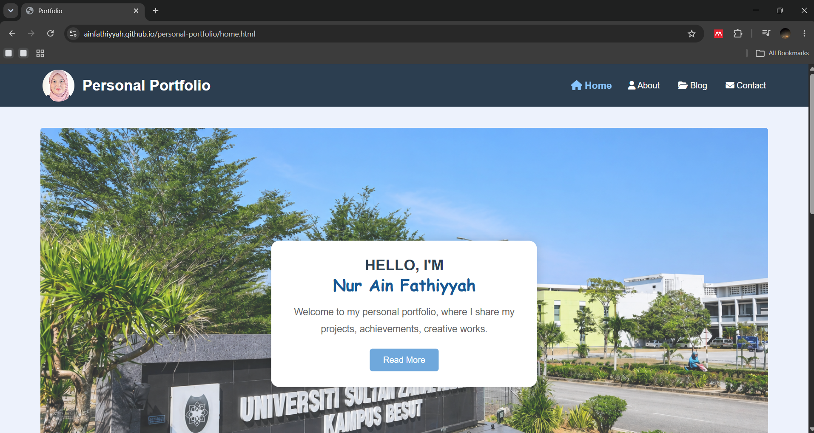 | 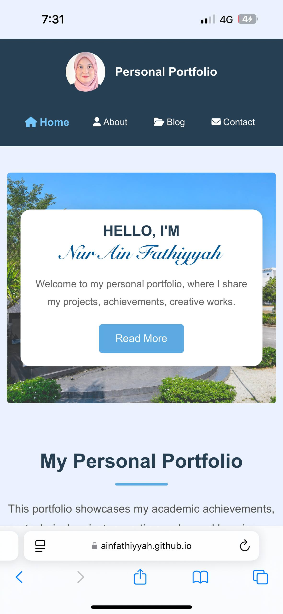 |

| Desktop View (Laptop) | Mobile View (Phone) |
| :---: | :---: |
| 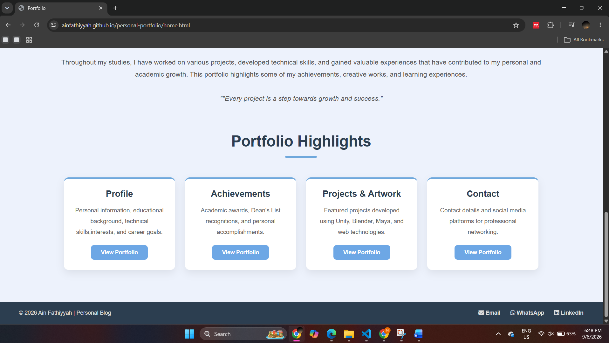 | 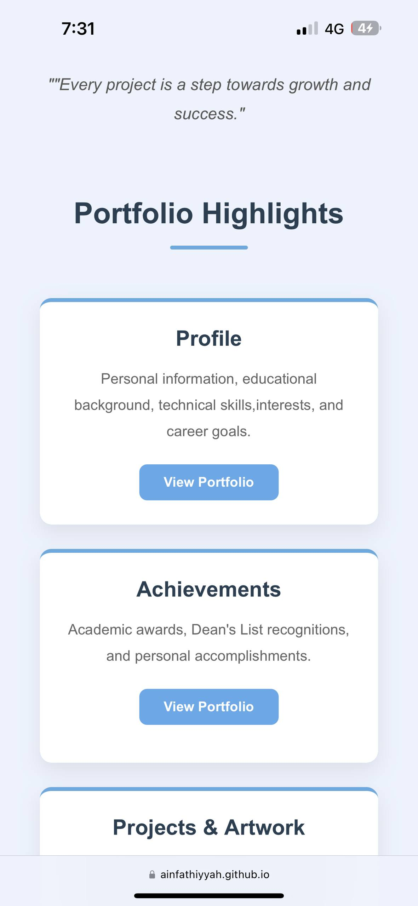 |

### About Page

| Desktop View (Laptop) | Mobile View (Phone) |
| :---: | :---: |
| 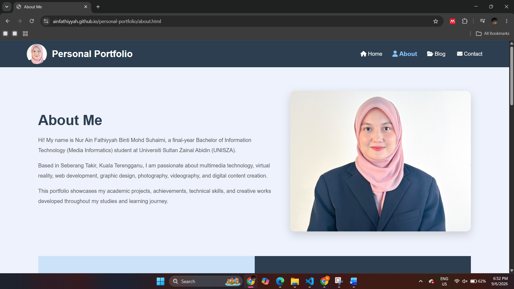 | 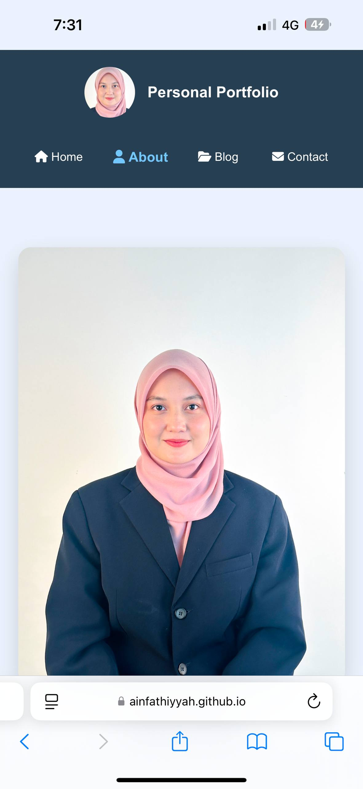 |

| Desktop View (Laptop) | Mobile View (Phone) |
| :---: | :---: |
| 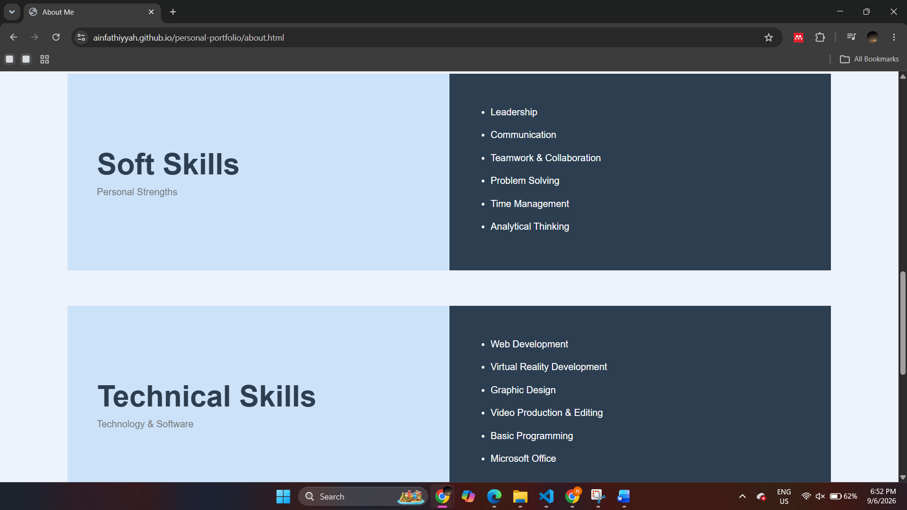 | 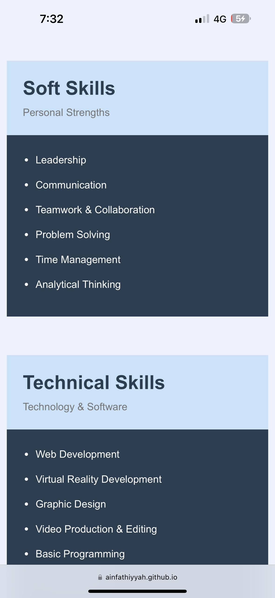 |

### Blog Page

| Desktop View (Laptop) | Mobile View (Phone) |
| :---: | :---: |
| 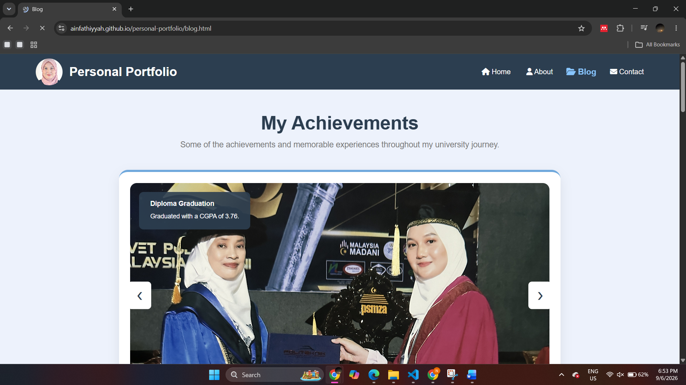 | 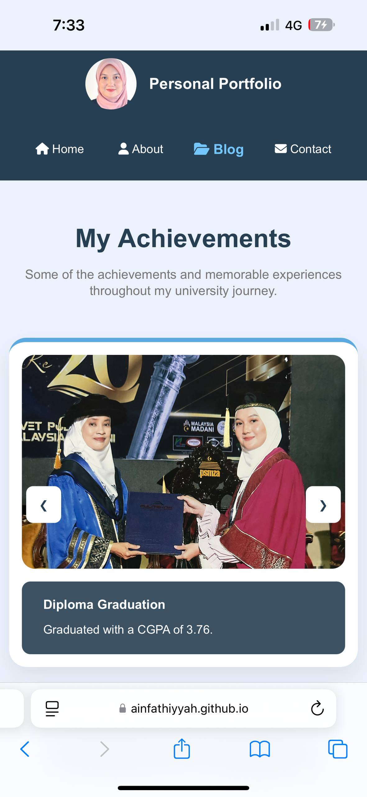 |

| Desktop View (Laptop) | Mobile View (Phone) |
| :---: | :---: |
| 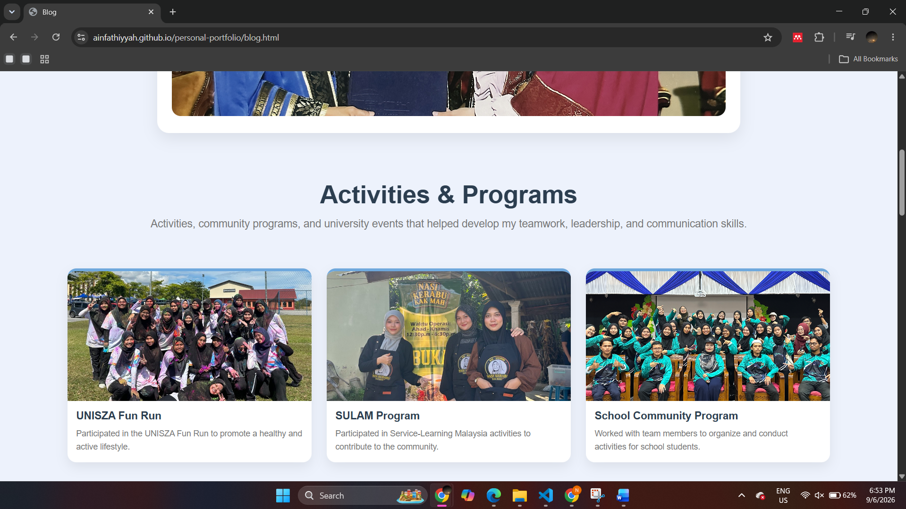 | 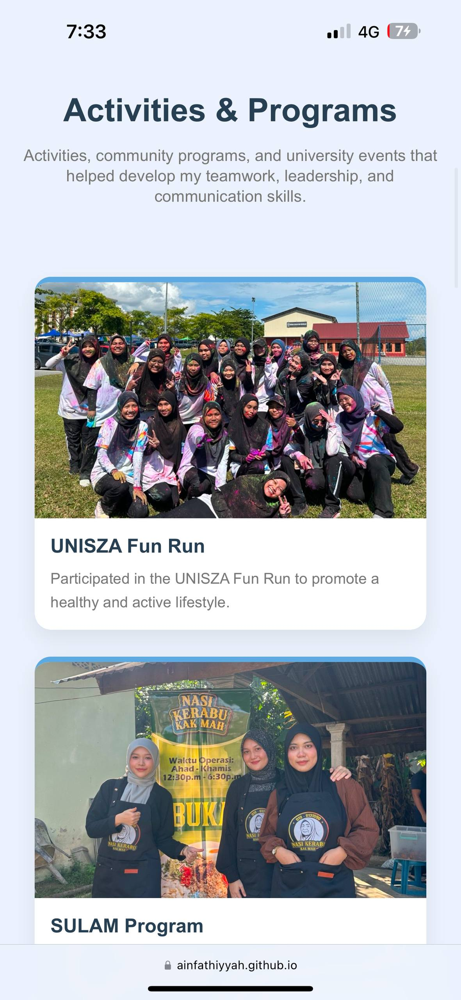 |

| Desktop View (Laptop) | Mobile View (Phone) |
| :---: | :---: |
| 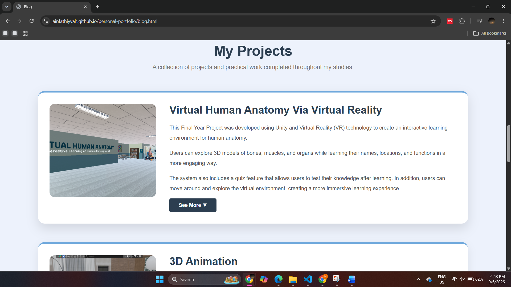 | 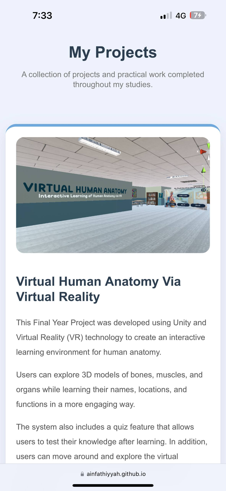 |

| Desktop View (Laptop) | Mobile View (Phone) |
| :---: | :---: |
| 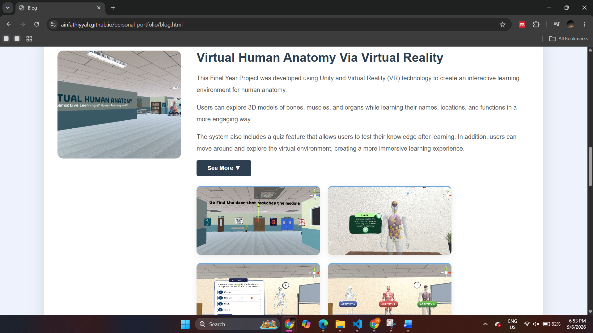 | 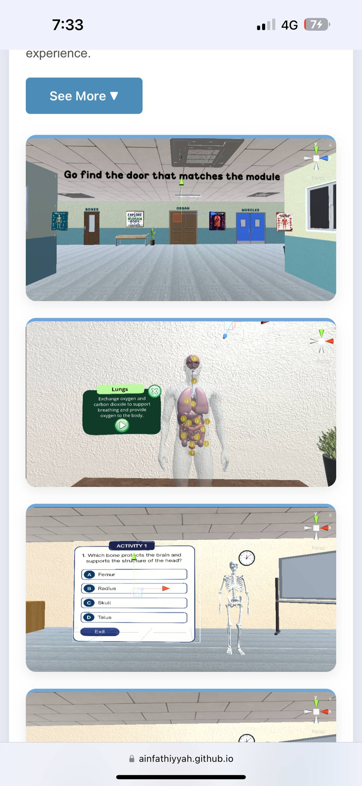 |

| Desktop View (Laptop) | Mobile View (Phone) |
| :---: | :---: |
| 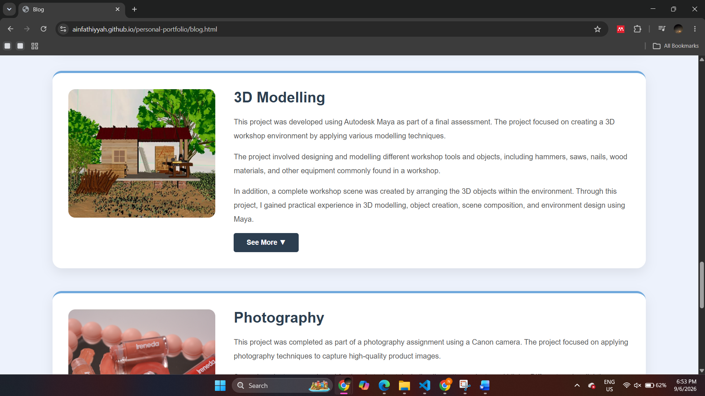 | 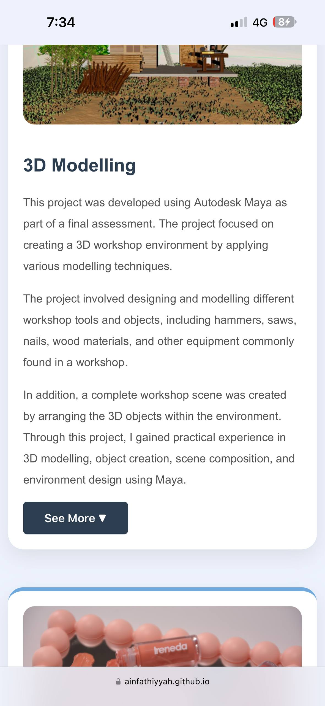 |


### Contact Page

| Desktop View (Laptop) | Mobile View (Phone) |
| :---: | :---: |
| 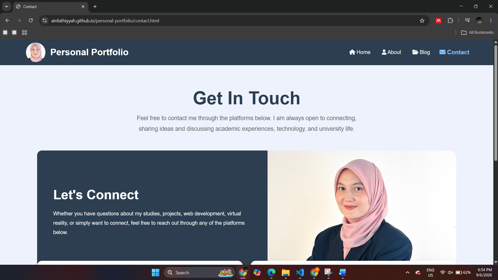 |  |

| Desktop View (Laptop) | Mobile View (Phone) |
| :---: | :---: |
| 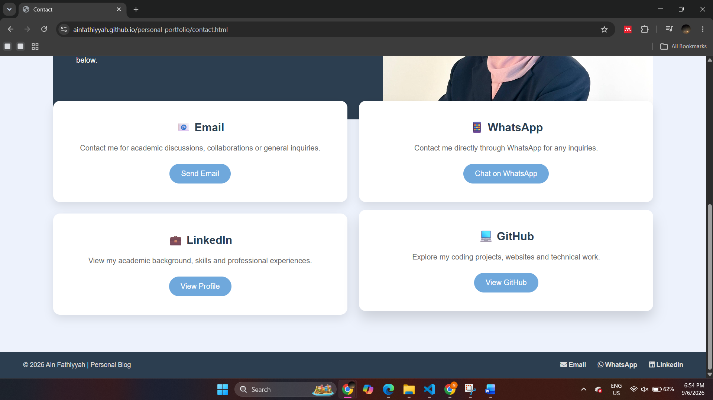 |  |

---

## 5. How to Run the Project

To access or clone this repository:

- **Clone the repository:**

```bash
git clone https://github.com/ainfathiyyah/personal-portfolio.git
```

- **Open Locally:**
Open the `home.html` file using any modern web browser.

- **Alternative Access:**
Users may also access the website directly through GitHub Pages without downloading the project files.

---

## 6. Project Demo

You can access the live website here:

**Website Link:**  
https://ainfathiyyah.github.io/personal-portfolio/home.html

The website is fully responsive and can be viewed on desktop, tablet, and mobile devices.

### GitHub Repository
https://github.com/ainfathiyyah/personal-portfolio

---

## 7. Development Process

The development process began with planning the website structure and organizing content for each page, including Home, About, Blog, and Contact.

The website was developed using HTML5, CSS3, and JavaScript while applying responsive web design principles to ensure compatibility across different screen sizes and devices.

Throughout the development process, various multimedia elements such as project galleries, achievement sliders, external YouTube links, images, and interactive buttons were integrated to improve user experience and present information in a more engaging way.

Several rounds of testing and refinement were conducted to improve layout consistency, responsiveness, navigation flow, and overall website usability.

Version control was managed using GitHub, while deployment was completed through GitHub Pages to provide public access to the portfolio website.

---

## 8. Author

**Name:** Nur Ain Fathiyyah Binti Mohd Suhaimi

**Programme:** Bachelor of Information Technology (Media Informatics) with Honours

**University:** Universiti Sultan Zainal Abidin (UNISZA)

**GitHub:** https://github.com/ainfathiyyah


